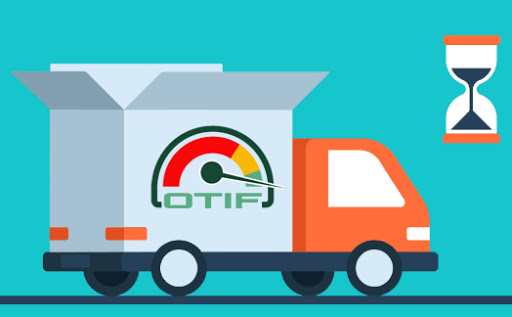

# Dashboard Logístico

  

#

**O que é OTIF?**
O *On Time In Full* (OTIF) é um dos principias KPIs logísticos. Sua utilização permite acompanhar a qualidade das entregas dos produtos, permitindo avaliar a eficiencia da logística da empresa.

Esse indicador é composto por dois fatores de qualidade esperado:
  * *On Time* - Os produtos/serviços devem ser entregues numa determinada data, horário ou janela de horas em local previamente combinado com o cliente. Mede a **Pontualidade** do pedido. 
  * *In Full* - Os produtos/serviços devem estar dentro das especificações acordadas com o cliente: qualidade intrínseca, dimensões, quantidade, perfeitas condições físicas e quaisquer outros atributos específicos. **Mede a aderência do pedido ao escopo** combinado.

Portanto, ao analisar o conjunto desse dois fatores, é possivel verificar os pontos de ineficiência e prover informações relevantes para a realização de ajustes. Alguns dos benefícios proporcionados por esse KPI são:
  * Identificação da origem das falhas e atrasos nas entregas
  * Redução de custos e aumento da margem de lucro
  * Melhoria na percepção de valor dos clientes
  
 > O **objetivo** do projeto foi automatizar a criação dos indicadores e listar os principais influenciadores.
 
 Para criação do Dashboard foi utilizado o vizual de  ***influenciadores principais***, que permite entender os fatores que influenciam uma métrica na qual está interessado. Ele analisa os dados, classifica os fatores importantes e os exibe como influenciadores principais.
  
#

  

  

  

  

p align="center">
  

p align="center">
  

# 
